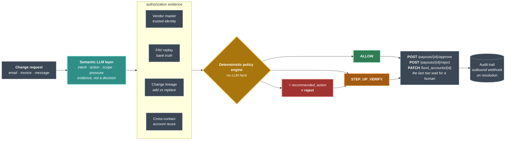

# BaseDrift — Architecture

A pre-authorization decision layer for RazorpayX payouts. It intercepts at the
`payout.pending` webhook — while the payout is frozen and no money has moved —
and decides whether the *authorization provenance* of the destination account
can be established.

This document is standalone. It assumes no prior reading of the README.

**[← README](README.md)** · **[Pitch](PITCH.md)** · **[Rulebook](RULEBOOK.md)** · **[Architecture](ARCHITECTURE.md)** · **[Evaluation](EVALUATION.md)** · **[What broke](FINDINGS.md)** · **[Build log](BUILD-LOG.md)** · **[Compliance](COMPLIANCE.md)**

---

## 1. The loss class, and why it is not the obvious one

Razorpay already ships two controls that look like they solve this:

| control | proves | leaves open |
|---|---|---|
| Fund Account Validation | the account is real, and the name matches **what you submitted** | whether you submitted the right name |
| Reverse Penny Drop | the account holder's identity, via their own UPI payment | whether they are your vendor, or authorized this change |

Both are **ownership** checks. Business Email Compromise does not attack
ownership — the attacker genuinely owns the destination account and will pass
either check. What is missing is evidence that the *legitimate vendor asked for
the change*.

FAV compares the bank's registered name against "the name provided by the
customer" — a field the requester controls. A finance team that trusts a spoofed
email feeds the attacker's preferred name into the check themselves, and it
comes back green.

**BaseDrift verifies authorization provenance: did this vendor, through a
channel they do not control, ask for this?**

---

## 2. Where it sits



The interception point is deliberate. At `payout.pending` the payout exists, is
frozen, and no money has moved — the only moment where prevention is possible
without asking the merchant to change their payout code. It also survives a
bypass Razorpay documents itself: Approval Workflow can be disabled for API
payouts, at which point pending payouts are auto-processed. BaseDrift runs at
the webhook layer and is unaffected by that toggle.

---

## 3. The boundary that defines the system

**The LLM never decides. It converts unstructured communication into structured
evidence; a deterministic rule engine makes the money decision.**

This is enforced, not asserted:

- an `ALLOW` always requires the payout's **real destination account** — resolved
  from RazorpayX, never the account number read out of the email — to match the
  vendor master, on every rule
- `decide()` raises if any inbox-derived signal claims Tier 1 or returns `PASS`
- the worst a hostile or mistaken extraction can achieve is downgrading a
  rejection recommendation to a plain hold — never a release

Both halves of that guard are individually tested, after mutation testing showed
a compound condition where either clause could be deleted with the whole suite
still green.

**Nothing rejects unattended.** The harshest outcome the engine reaches on its
own is a hold. Rules that once rejected now attach
`recommended_action="reject"` and wait for a person. A rejection prevents no
fraud a hold does not — the money stays put either way — and a hold costs a
phone call where a rejection costs a vendor their payment.

---

## 4. Signals, in two tiers

**Tier 1 — identity**, checked against the merchant's own vendor master:
`name_match`, `account_status`, `gstin`, `account_continuity`.

**Tier 2 — circumstances**, which corroborate and never decide alone:
`sender_domain`, `urgency`, `channel_manipulation`, `payment_pattern`, plus
inbox-derived signals.

The split exists because Tier 2 evidence is attacker-shapeable. Somebody inside a
mailbox can send themselves messages, build thread depth and manufacture months
of correspondence. **Evidence an attacker can author must never be able to say
yes.**

Signals carry **four** states, not three:

| | meaning |
|---|---|
| `PASS` | checked, clean |
| `WARN` | checked, adverse evidence |
| `INCONCLUSIVE` | could not check |
| `FAIL` | direct conflict with the vendor master |

`WARN` and `INCONCLUSIVE` both hold a payout, but only `WARN` may contribute to
a rejection recommendation. Missing data must never push a case toward refusing
to pay somebody.

---

## 5. The rule table

First match wins. The authoritative version lives in the `decision_engine.py`
module docstring, and the code implements exactly it.

| | rule | outcome |
|---|---|---|
| R1 | extraction failed | hold — *"could not check" ≠ "found fraud"* |
| R2a | claims no change, destination is a known account | **allow** |
| R2b | claims no change, destination unknown | hold — the claim contradicts the payout |
| R2c | destination belongs to another vendor | hold + recommend reject |
| R3 | any Tier 1 `FAIL` | hold + recommend reject |
| R4 | replace + new account + deception + **independent** Tier 2 warn | hold + recommend reject |
| R5 | any Tier 1 `WARN`/`INCONCLUSIVE` | hold |
| R6 | any Tier 2 `WARN`/`INCONCLUSIVE` | hold |
| R7 | everything clean | **allow** |

Two of these carry findings worth reading:

**R2 used to return `ALLOW` on the intent label alone**, before any identity
check ran — which made a single LLM output sufficient to release a payout, and a
prompt injection reaching `PAYMENT_FOLLOWUP` a complete bypass. It now verifies
the claim against the resolved destination.

**R4's corroboration requirement was fake.** The only signal setting `deception`
is `sender_domain`, which is itself a Tier 2 warn — so `deception and
len(t2_warn) >= 1` was satisfied by its own first clause. The reason string told
operators a rejection was *"corroborated by sender_domain"*, counting the
impersonation as its own corroboration. Corroboration must now come from a
different signal.

---

## 6. The trust store, and how it gets poisoned

Every check resolves against the vendor master, which makes the master the thing
worth attacking. `vendor_accounts.csv` therefore carries provenance per account:
`added_via`, `verified_by`, `settled_payout_count`, `added_on`.

**Being *on file* is not the same as being *established*.** An account that
entered the master because one email asked for it, was never verified by
anything outside email, and has never carried a payout, resolves to
`INCONCLUSIVE` rather than `PASS`. Without that, an attacker who plants an
account with one accepted request can wait, then ask for the money — and every
identity check passes *honestly*, on a fact that is itself the fraud.

---

## 7. Verification: two channels, deliberately ordered

A hold is not an answer. The engine states what would release the payment.

1. **Callback** to `vendor.known_phone` — never a number in the request, because
   a request that can change an account can change the phone number under it.
2. **Reverse Penny Drop from a named account** — ₹1 from an account the merchant
   has already been paying.

The penny drop is **authoritative** and the callback corroborates, not the
reverse. SIM-swap fraud has the callback *passing* — the attacker answers the
phone — so "either channel confirms" would release exactly the cases the second
channel was added for.

**Which account is demanded is the entire control.** "Prove you control an
account on file" lets an attacker use one they planted. `select_verification_
account()` names the account: seasoned, settled, and not added by the channel
now being verified. When no account qualifies, that is a third state —
*unavailable* — which escalates and never falls back to the phone.

---

## 8. The operator layer

A held payout is somebody's money, so the person holding it must be able to say
why. The dashboard shows every signal, what it found, and where the evidence
came from — deliberately more than the webhook reply, which carries no reason
strings because those embed account numbers and cross the public internet.

**Every internal code is translated** (`vocabulary.py`): `R5_tier1_inconclusive`
becomes *"Identity checks could not be completed"*, with the identifier kept
beside it — an operator cannot act on a symbol, and an auditor cannot accept a
paraphrase of the policy.

**The buttons record what a human did outside the system** — a call placed on a
number the supplier did not choose, a rupee that arrived from the named account.
Case state is a fold over an append-only log, never a stored field, so a case
cannot claim a status its own history does not support.

**Segregation of duties is enforced server-side.** Whoever records a
verification outcome may not release the payment. A compromised or complicit AP
clerk who can do both approves their own request, and every upstream control
becomes theatre. A greyed-out button stops an honest mistake; only a check on
the POST stops the attack. Rejection is deliberately *not* segregated — the rule
protects money leaving, and refusing to pay releases nothing.

---

## 9. Layout

```
src/decision_engine.py   deterministic policy. Rule table in the docstring.
src/extractor.py         THE ONLY LLM STEP. Semantic layer + claims.
src/llm_client.py        one place that talks to a provider; resamples
                         malformed JSON rather than repairing it
src/webhook.py           payout.pending handler. HMAC over raw bytes,
                         constant-time compare, replay window, dedupe.
src/verifier.py          two channels; names the penny-drop account
src/casefile.py          what a human did; the two-person rule
src/dashboard.py         operator view
src/vocabulary.py        every internal code → what an AP clerk would say
src/triage.py            inbox funnel, no model call until it must
src/notifier.py          outbound webhook when a case resolves, signed
mcp/inbox_server.py      read-only MCP tools over the merchant's mailbox
eval/rules_eval.py       decision engine vs baselines, no API key
eval/extraction_eval.py  what the real model costs against that reference
eval/base_rates.py       converts precision into phone calls per day
data/generate_data.py    seeded generator; 900 labelled cases
```

---

## 10. What is real, and what is not

**Real and running:** the decision engine and its rule table; the semantic layer
against a live model; the webhook handler including HMAC verification, replay
and idempotency; document correlation; the triage funnel and its MCP tool layer;
the operator dashboard, case file and two-person rule; 303 tests; six evaluators.

**Simulated:** every RazorpayX boundary. `Store` stands in for fund-account and
vendor lookups that would be API reads. FAV results are replayed
schema-faithfully. The callback outcome comes from scenario ground truth.
`razorpay_actions()` emits action **plans** — nothing in this repository calls
Razorpay.

**Confirmed impossible to exercise in a sandbox.** Razorpay's own documentation
states the Approval Workflow is unavailable in test mode, "which means the
`pending` and `rejected` states are not available." A payout can never *reach*
pending there, so the event this system is built around cannot fire, and the
outbound approve/reject endpoints have nothing to act on. Live mode with
Approval Workflow enabled is what it takes — a commercial prerequisite, not an
engineering one.

---

## 11. Failure behaviour

**The safe state is inaction.** A pending payout stays pending unless something
explicitly approves it, so every failure path — bad signature, unknown fund
account, unknown vendor, unreadable document, a crashed process, BaseDrift
being down entirely — leaves the money where it is. There is no code path that
releases a payout on error, which is why a 500 is an acceptable response:
Razorpay retries, and nothing has moved.

The outbound notification follows the same rule in reverse: a case is resolved
because it is written down, not because a POST succeeded, so delivery failures
cannot affect a decision.

---

## 12. Known limitations

- **Not production-deployable.** No authentication on `/documents`, `/messages`,
  the dashboard or the case-action endpoint; no encryption at rest; the handler
  calls the model inline where Razorpay expects a fast 2xx. See `COMPLIANCE.md`.
- **The two-person rule's identity is a cookie, not authentication.** The
  authorization rules are real and enforced server-side; the identity they apply
  to is chosen. It demonstrates the control rather than being it.
- **Synthetic corpus.** 900 cases from a seeded generator, fraud oversampled to
  roughly half for statistical power. `base_rates.py` converts the measured
  rates to realistic volumes rather than pretending the distribution is real.
- **Tier 2 catches nothing on this corpus.** R6 fires on legitimate traffic only.
  It is kept as defence in depth for a merchant master lacking provenance
  columns, and reported as measurable-at-zero rather than as a win.
- **Recall of 100% is a ceiling, not a result** — until the corpus was made able
  to fail, which it now is: adding the planted-account exploitation scenario
  dropped recall to 93.8% before a rule closed it.

---

## 13. The webhook, and the problem it has to solve

RazorpayX fires `payout.pending` while the payout is frozen. That event says
money is about to move — it does **not** say what document requested the
destination, and authorization provenance is the entire question here. Two
inputs are needed and only one arrives on the webhook.

The merchant's AP system supplies the other via `POST /documents`. Correlation
prefers an explicit `notes.basedrift_document_id` on the payout, falls back to
the most recent document for that vendor inside a 30-day window, and otherwise
finds nothing.

**Finding nothing is not an error.** It is a true statement — nobody asked for
the destination to change — so it is expressed as `intent=PAYMENT_FOLLOWUP`,
tagged `evidence_source="no_document_supplied"` so no audit reader can mistake
it for something a model read, and handed to the same decision engine as
everything else. Rule R2 already encodes the right policy:

| destination | outcome | why |
|---|---|---|
| a known account for this vendor | ALLOW | nothing changed; nothing to authorize |
| an account never seen before | HELD | money moving somewhere new with nothing authorizing it |
| an account on file for another vendor | HELD + recommend reject | cross-contact reuse |

The handler decides nothing itself. It gathers evidence and calls `decide()`.

**The destination comes from the payout's own fund account**, resolved through
RazorpayX, never from an account number quoted in the request. A message naming
the vendor's genuine account while the payout points elsewhere is caught here,
at the integration boundary.

#### Fail-safe by construction

The safe state is inaction. A pending payout stays pending until something
explicitly approves it, so every failure — bad signature, unknown fund account,
unknown vendor, unreadable document, a crashed process, BaseDrift being down
entirely — leaves the money where it is. There is no code path that releases a
payout on error, which is why a 500 is an acceptable response: Razorpay retries,
and nothing has moved in the meantime.

#### Telling the merchant's systems how it ended

The inbound webhook is Razorpay saying a payout is pending. The outbound one is
BaseDrift saying a held payout was released or refused, and by whom — otherwise
an ERP can only learn the outcome by someone watching the dashboard.

```
POST https://your-erp/hook
X-BaseDrift-Signature: <hmac-sha256 of the exact body, BASEDRIFT_WEBHOOK_SECRET>

{"event": "basedrift.case.released",
 "payload": {"case": {
    "payout_id": "pout_1", "resolution": "released",
    "resolved_by": "Rahul Iyer", "rule_fired": "R5_tier1_inconclusive",
    "history": [{"action": "callback_confirmed", "actor": "Priya Menon", ...},
                {"action": "released",           "actor": "Rahul Iyer",  ...}]}}}
```

Configured with `BASEDRIFT_WEBHOOK_URL` and `BASEDRIFT_WEBHOOK_SECRET`; with
no URL it does nothing and says nothing.

**It fires only on `released` and `rejected`.** Intermediate states are not facts
another system can act on, and every extra emission is one more place an account
number travels.

**A failed delivery cannot affect a decision.** The case is resolved because it
is written down, not because a POST succeeded — so the notifier swallows delivery
errors *and* the call site catches everything before the POST too. A test kills a
release by making the notifier itself raise, and the release still happens. That
test found a real gap: `build_event` and `json.dumps` run outside the notifier's
own `try`, so a non-serialisable audit would have taken a release down with it.

**It is signed with the scheme we demand of Razorpay.** Telling a finance system
"this payout was released" is worth forging, and sending unsigned would be asking
of others what we refuse ourselves. Production still wants a durable queue — this
posts once, inline, and a dropped event is dropped; the event id is there for the
receiver to deduplicate on.

#### Signature verification

HMAC-SHA256 over the raw body, per Razorpay's spec, with three details that are
each a real vulnerability if got wrong: the signature covers the bytes **as
received** rather than re-serialized JSON, the comparison is constant-time
(`hmac.compare_digest`), and malformed input returns False rather than falling
through. Events outside a 15-minute window are refused even with a valid
signature, and repeated event ids are not reprocessed.

A missing or zero `created_at` is refused rather than waved through. An earlier
version guarded that check with a truthiness test, which is falsy at zero and so
skipped freshness validation on exactly the events whose age could not be
established — caught by the test asserting that no input path releases a payout.

---
