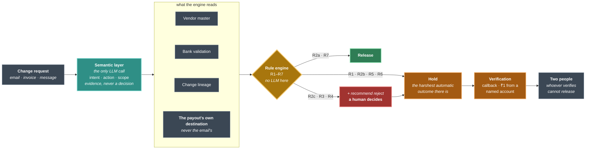

# BaseDrift

[](https://github.com/vidit-16/BaseDrift/actions/workflows/tests.yml)
[](https://vidit-16.github.io/BaseDrift/inbox.html)
[](tests/)
[](tools/mutate.py)
[](EVALUATION.md)

**A verified bank account and a verified account holder are not proof that a
beneficiary change was authorized.**

BaseDrift is a pre-authorization decision layer for outbound payments. It
intercepts at the RazorpayX `payout.pending` webhook — while the payout is
frozen and no money has moved — verifies the *authorization provenance* of the
proposed destination against the merchant's own vendor master, and resolves to
approve or hold.

The vendor master is the **base**: where a supplier has been paid, established
over time and under the merchant's control. Fraud is **drift** away from it — a
destination with no history, no corroboration, and nothing behind the request to
move it but the request itself. BaseDrift is what runs before the money does,
and it holds anything whose authorization it cannot establish.

> **Precisely:** the decision layer, the webhook handler and the evaluation are
> real and run. The RazorpayX side is not connected — the engine emits
> approve/reject/deactivate calls as action plans, and nothing here executes
> them. [Why that is a platform constraint rather than a shortcut.](#the-integration-point-cannot-be-exercised-in-a-sandbox)

| | |
|---|---|
| **[The pitch](PITCH.md)** | What this is and why, in one read |
| **[The rulebook](RULEBOOK.md)** | Every decision the engine can reach, and what to do about it |
| **[Architecture](ARCHITECTURE.md)** | How it is built, and the boundary that defines it |
| **[Evaluation](EVALUATION.md)** | The numbers, the methodology, and what they cannot tell you |
| **[What broke](FINDINGS.md)** | Four ways this could have released a payout it should not have |
| **[Build log](BUILD-LOG.md)** | The working record — every item, what it measured, what it does not show |
| **[Compliance](COMPLIANCE.md)** | What production would have to satisfy |

---

## At a glance

**Held out on 276 cases, scored once, never tuned against:**

| | BaseDrift | hold everything, run no rules |
|:--|:--:|:--:|
| fraud not released | **100%** | 100% |
| precision | **87.4%** | 86.3% |
| **legitimate payments rejected** | **0.0%** | 0.0% |
| legitimate payments held for review | **14.6%** | 16.1% |
| released with no phone call | **20.7%** | **0%** |

**Read the second column first.** A pipeline that holds every payout and phones
every vendor scores 100% on this data too, and beats us on nothing but effort.
On accuracy we are one point from doing nothing clever at all — which is why the
last row is the one that matters, and why this table is here rather than buried.

**The corpus can fail, and it has.** Adding the planted-account exploitation
scenario dropped recall to **93.8%** before a rule closed it. Recall of 100% on
a corpus that cannot fail is a ceiling, not a result.

**303 tests, and mutation testing proves they bite.** `tools/mutate.py` breaks
fifteen stated invariants in turn — the two-person rule, tier separation, the
trust-store anchor — and checks the suite notices. **15/15 killed.** An earlier
pass found two survivors, and *those were the finding*: a compound guard whose
clauses could each be deleted with every test still green.

**It is a control, not just a detector.** Whoever records a verification cannot
release the payment — enforced on the POST, not by greying out a button. A clerk
who can do both approves their own request.

**Two false-positive costs, not one.** A rejected vendor and a phoned vendor are
different events; collapsing them hides which you are causing.

**Honest gaps, quantified:** the corpus is synthetic with fraud oversampled
(`eval/base_rates.py` converts the rates to real volumes); Tier 2 catches
nothing measurable here and is kept as defence in depth; there is no
authentication anywhere; and the integration point is **confirmed
un-exercisable** in Razorpay's sandbox.

---

## The gap, in Razorpay's own words

Fund Account Validation compares the name returned by the bank against **"the
name provided by the customer"**
([docs](https://razorpay.com/docs/x/fund-account-validation/)). That name
arrives in the `bank_account.name` field of Create Fund Account — supplied by
whoever makes the request.

A finance team that receives a spoofed bank-change email and trusts the name in
it supplies the attacker's preferred name into the check themselves. FAV returns
a near-perfect match. Razorpay's own docs then note: *"if your user provides an
account number by mistake which is not where the user wants the amount, the
payout gets processed if the account number exists."*

Reverse Penny Drop does not close it either. RPD requires the account holder to
send ₹1 by UPI from the account being verified — an attacker who owns that
account completes the flow normally. Ownership proven. Authorization not.

| Control | Proves | Leaves open |
|---|---|---|
| Fund Account Validation | Account is real; name matches what *you submitted* | Whether you submitted the right name |
| Reverse Penny Drop | The account holder's identity, via their own payment | Whether they are your vendor, or authorized this change |
| Approval Workflow | An internal role approved the payout | Whether the external vendor authorized the change |
| Source to Pay | Vendor onboarded in-portal with verified GSTIN | Whether an out-of-band email requesting a change is genuine |
| **BaseDrift** | **Authorization provenance of the change request** | — |

### The bypass BaseDrift survives

Approval Workflow can be disabled **for API payouts only**, and on disabling
*"all the payouts in pending state are rejected automatically and the payouts
are processed without approval."* A compromised integration with API credentials
skips human review entirely. BaseDrift runs at the webhook layer and is
unaffected by that toggle.

---

## Architecture



**Read it in one line:** the model turns an email into evidence, and a rule
table with no model in it decides what happens to the money.

**Two arrows are the whole design.** Nothing reaches ALLOW without the
payout's real destination matching the vendor master — so no model output can
release a payment on its own. And nothing reaches a rejection without a person:
a rejection recommendation is a *recommendation* attached to a hold, never an action.

**The LLM never decides.** It converts unstructured communication into
structured semantic evidence; a deterministic rule engine makes the money
decision. It is called once, returns JSON, and holds no tools.

**And neither does the rule engine reject anything.** The harshest outcome it
can reach alone is a hold. Rules that once rejected now attach
`recommended_action="reject"`, and both the reject and the fund-account
deactivation are emitted flagged `requires_human_confirmation`. This costs
nothing in capture — the money stays put either way — and it removes the only
customer-facing failure the system had. **A hold costs a phone call; a rejection
costs a vendor their payment.**

Stated as the property that is actually enforced and tested: **an ALLOW always
requires the payout's real destination to match the vendor master.** No
combination of model output can produce one on its own. The worst a hostile or
mistaken extraction achieves is downgrading a rejection recommendation to a
plain hold — never a release.

This was not true until recently. R2 used to return ALLOW on the intent label
alone, before any identity check ran. See **[what broke](FINDINGS.md)**.

→ **[The full rule table, and what each outcome asks a person to do](RULEBOOK.md)**

---

## The ablation result

The central claim is that the LLM does **semantic normalization**, not entity
extraction. That is tested, not asserted.

Messages expressing the same underlying request, classified into
`(intent, action, scope)`. A keyword/regex baseline and the LLM see identical
inputs and identical ground truth.

| Corpus | Keyword baseline | LLM semantic layer |
|---|---|---|
| v1 (vocabulary-cued) | 92.3% | — |
| **v2 (inference-only, 14 cases)** | **0/14 — 0.0%** | **14/14 — 100%** |
| Control false positives | **4/4** legit follow-ups flagged | **0/4** |

Corpus v2 removes trigger vocabulary entirely. No case states "replace", "add",
"update", or any scope keyword:

- **Scope** is inferred from *which invoices are referenced*.
- **Add vs replace** from *whether the existing account keeps a role* — which
  matters, because RazorpayX permits
  [multiple fund accounts per contact](https://razorpay.com/docs/x/fund-accounts/),
  so treating every new account as a replacement is a real logic error.
- **Controls** contain account numbers, IFSC codes and change vocabulary while
  requesting no change to *this* vendor's destination.

The baseline code is byte-identical across both runs. It was not weakened for
v2.

**Corpus v1's 92.3% was our own methodology error**, kept as a record: the
paraphrases were written first and the keyword trigger lists written afterwards
to match them — evaluation leakage, the exact failure the dataset methodology
was designed to avoid, reappearing one layer up. A leakage guard now makes that
a hard failure that stops rendering.

**And 14 cases is a small sample.** A perfect score means the corpus has stopped
discriminating between capable models, not that the layer is flawless. What it
supports is the *contrast* — 0/14 against 14/14 on identical inputs — not the
absolute figure.

```bash
python eval/ablation.py
```

---

## The operator view

```bash
python src/demo.py --serve      # loads the inbox, then serves the dashboard
```

**There is a frozen copy in [`docs/`](docs/)** — 325 pages, browsable without
running anything. Deliberately a snapshot rather than a deployment: this app has
POST routes with no authentication in front of them, and a tunnel means anyone
who finds the URL can resolve a case while you are presenting. The snapshot has
no POST routes at all; the buttons are drawn and inert.

`/inbox` is the mailbox as triage saw it; `/` lists decisions newest first. The
point is not that the system returns a verdict — it is that **every verdict is
attributable.** A held payout is somebody's money, and the person holding it has
to be able to say why.

**Every message opens, including the ones triage filtered out.** That is a
control, not a convenience: the failure this layer is most exposed to is
silently binning a real change request. The mail comes first on the page and the
machine's reading second, because an operator who reads the verdict first
inherits its conclusion.

A held case shows what would release it, and names the account:

```
On hold          R5_tier1_inconclusive
Identity checks could not be completed

  Not evidence of fraud — evidence we could not confirm identity.
  Verify through a channel the requester does not control.

VERIFICATION — WHAT WOULD RELEASE THIS
  Ask the supplier to send Rs 1 from this account, and no other:
      926841336891
  chosen because 43 settled payout(s), added 2024-12-29 via onboarding,
  verified by onboarding_kyc
```

**The buttons record what a human did, and refuse what one person should not do
alone.**

```
POST /case/pout_bec/action  action=released  actor=Priya Menon
  → Refused. You recorded the verification on this case, so you cannot
    also release it. A different person must.
```

---

## Setup

```bash
pip install -r requirements.txt
python data/generate_data.py    # vendor master, accounts, dev/holdout splits
python data/generate_inbox.py   # the AP inbox around those cases
```

Everything here runs with **no API key**:

```bash
python tests/run_all.py       # 303 tests across 9 suites
python tools/mutate.py        # 15 mutations of stated invariants
python eval/rules_eval.py     # rule scoring vs baselines
python eval/triage_eval.py    # inbox funnel, and the allowlist counterfactual
python eval/base_rates.py     # daily call volume vs the null baseline
python src/demo.py            # THE DEMO — one payout, end to end, ~2 min
python src/demo.py --serve    # the same, then the dashboard on port 8000
python src/webhook_demo.py    # five signed scenarios over real HTTP
```

And the steps that cost API calls:

```bash
python src/pipeline.py                      # the hero case, one call
python eval/extraction_eval.py --split dev  # 624 calls, cached and resumable
python eval/ablation.py                     # semantic vs keyword ablation
```

### Choosing a provider

The pinned model, `gpt-oss-120b`, is **open-weight** — the model does not change
when the provider does. That is what keeps the data-localisation option in
[COMPLIANCE.md](COMPLIANCE.md) open, and why the provider is configuration
rather than code.

| variable | what it does |
|---|---|
| `BASEDRIFT_BASE_URL` | provider root, OpenAI-compatible. Defaults to Groq |
| `BASEDRIFT_API_KEY` | key for that provider. Falls back to `GROQ_API_KEY` |
| `BASEDRIFT_MODEL` | pin a model id, skipping detection |
| `BASEDRIFT_PROVIDER` | routing layers only: the hosts allowed to serve the model |
| `BASEDRIFT_CALL_GAP` | seconds between calls. Default 7.0 |

**`BASEDRIFT_CALL_GAP` is the one to change first.** 7 seconds exists to stay
under a free tier's per-minute ceiling. Anywhere else it adds 93 minutes to an
800-case run for nothing.

```powershell
$env:BASEDRIFT_API_KEY="sk-..."           # PowerShell, current session
```
```bash
export BASEDRIFT_API_KEY="sk-..."         # macOS / Linux
```

`eval/extraction_eval.py` caches every result keyed by message hash, model and
prompt hash, so it is resumable and re-running costs nothing. It never caches a
transport failure: a rate-limited run once persisted 201 "extraction failed"
records that would have poisoned every later scoring pass with a 56% failure
rate that was really the network.

---

## Layout

```
src/
  llm_client.py       the only module in the decision path that talks to a
                      provider; model auto-detect, 429 retry
  extractor.py        the only LLM step; semantic layer + claims
  decision_engine.py  deterministic policy; full rule table in the docstring
  verifier.py         two verification channels; names the account the penny
                      drop must come from
  pipeline.py         run_case() end to end → audit dict
  webhook.py          payout.pending handler; signature verification,
                      destination resolution, document correlation
  notifier.py         outbound webhook; signed, off unless configured, and
                      structurally unable to affect a decision by failing
  triage.py           inbox funnel: dedupe → ingest rules → vendor
                      resolution (no model) → classification
  inbox_signals.py    mailbox facts → Tier 2 signals that can hold a payout
                      and can never release one
  investigator.py     the one agent loop; read-only tools
  casefile.py         append-only case log; the server-side two-person rule
  dashboard.py        operator view
  vocabulary.py       every internal code → the operator's language
mcp/inbox_server.py   MCP inbox tools — read-only, scoped to one merchant
eval/                 rules · triage · base rates · extraction · ablation
tests/                303 tests across 9 suites, none needing an API key
tools/mutate.py       mutation testing of stated invariants
tools/snapshot.py     freezes the dashboard into docs/ as static HTML
data/                 seeded generator, renderer, and the committed corpus
docs/                 the frozen dashboard, 325 pages, no server required
```

**The corpus**, all seeded and reproducible:

| file | contents |
|---|---|
| `data/vendor_master.csv` | 120 vendors — the trusted record |
| `data/vendor_accounts.csv` | 250 accounts with provenance |
| `data/cases_dev.csv` | 624 labeled cases |
| `data/cases_holdout.csv` | 276 cases — gitignored, regenerate to reproduce |
| `data/inbox_dev.csv` | 25,584 messages, 2.4% of them change requests |

---

## What is real and what is simulated

Stating this plainly because the difference is easy to blur, and a fraud control
that overstates its own deployment status is exactly the failure mode it exists
to prevent.

**Real, and runs:** the decision engine and its rule table; the semantic layer
against a live model; the webhook handler including HMAC verification, replay
and idempotency handling; document correlation; the rules evaluation and the
ablation; the operator dashboard; the inbox triage funnel and its MCP tool
layer; the case file and its server-side two-person rule; 303 tests.

**Simulated:** every RazorpayX boundary. `Store` stands in for fund-account and
vendor lookups that would be API reads. FAV results are replayed
schema-faithfully. The callback outcome comes from scenario ground truth.
`razorpay_actions()` returns action *plans*; **nothing here calls Razorpay.**

### The integration point cannot be exercised in a sandbox

This is the sharpest constraint here, and worth stating exactly, because
"nothing calls Razorpay" otherwise reads like a gap someone chose not to close.

[RazorpayX Test Mode](https://razorpay.com/docs/x/dashboard/test-mode/) says:

> The Approval Workflow is not available in the test mode. This means the
> `pending` and `rejected` states are not available in the test mode.

| | in test mode |
|---|---|
| a payout reaching `pending` | **impossible** — the state does not exist there |
| receiving `payout.pending` | never fires; there is nothing to fire on |
| `POST /payouts/{id}/approve` and `/reject` | nothing to act on |

**Both halves of the loop are blocked**, so a partial integration does not work
either. It was considered and ruled out. Reaching this control point requires
live mode with Approval Workflow enabled, on a real current account, with Payout
Approval API access — commercial and onboarding prerequisites, not engineering
ones.

The honest next rung is **shadow mode** against a willing merchant: deciding
nothing, logging what it would have done. That is also the only thing that
produces a real false-positive rate, which is the number that actually decides
deployability.

---

## Defensive posture

This system decides whether to **hold money that is already moving**. It has no
outbound capability of any kind, and that is structural rather than a policy:

| | |
|---|---|
| Sending mail | **No SMTP, no mail client, no send function anywhere in the repository.** |
| Mailbox access | Every MCP inbox tool is read-only. A test greps for write verbs and fails the build if one appears. |
| Tool arguments | Derived from the message envelope, never its body. A test proves a hostile body produces byte-identical tool calls to a benign one. |
| The corpus generator | Renders synthetic messages so the extractor can be measured. No delivery path, no real recipients, no real vendors. |
| The engine's harshest act | A hold. No rule can produce a rejection — a test reads the engine's own source and asserts no `outcome=BLOCK` appears in it, so reintroducing the outcome means reintroducing the literal. |

The scenarios in `data/` describe attacks because a defence has to be measured
against something. Nothing here performs one.

---

## Scope boundary

BaseDrift protects an **already-onboarded** vendor from having a payout
redirected via a compromised or spoofed change request. It does not address a
wholly fraudulent vendor being onboarded — that is onboarding fraud, a different
pattern, and the vendor master is a trust boundary here.

The vendor master's own update path needs equivalent protection in production.
The same principle applies recursively: a master-record update should be
confirmed via the *existing* known contact, never via details supplied in the
request.

---

## Sources

- [Fund Account Validation](https://razorpay.com/docs/x/fund-account-validation/)
- [Account Validation APIs](https://razorpay.com/docs/api/x/account-validation/)
- [Fund Accounts — multiple per contact](https://razorpay.com/docs/x/fund-accounts/)
- [Reverse Penny Drop](https://razorpay.com/docs/x/fund-accounts/reverse-penny-drop/)
- [Approval Workflow](https://razorpay.com/docs/x/manage-teams/approval-workflow/)
- [RazorpayX Test Mode](https://razorpay.com/docs/x/dashboard/test-mode/) — why the integration point cannot be exercised in a sandbox
- [Payouts best practices](https://razorpay.com/docs/x/payouts/best-practices/)
- [FBI IC3 — Business Email Compromise](https://www.ic3.gov/PSA/2014/PSA140627.pdf)
