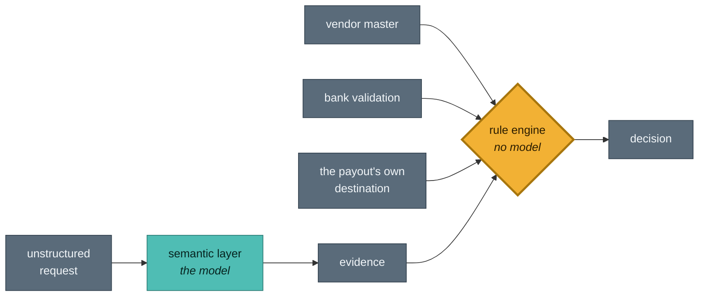
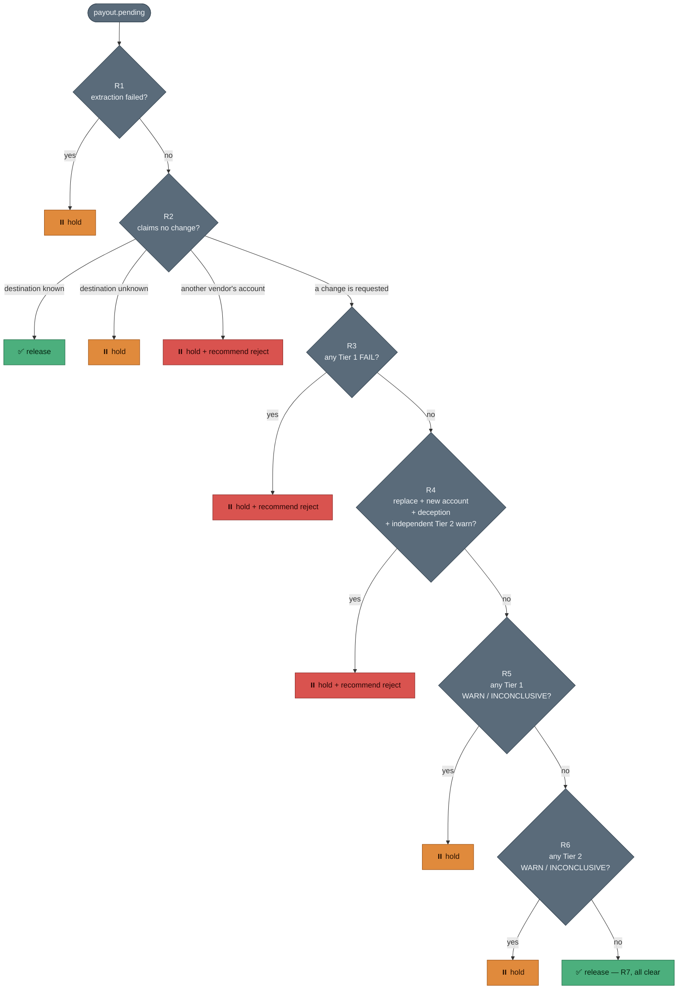

# BaseDrift — The Rulebook

Everything the decision layer can conclude, what makes it conclude that, and
what a person is expected to do next.

This document is written twice over, in the same tables: once in the language
of the code, because an auditor cannot accept a paraphrase of a rule table, and
once in the language an operator can act on, because nobody can act on
`R5_tier1_inconclusive`. Both come from the same place — `src/vocabulary.py`
holds the translation so the two can never drift.

**The authoritative version is the module docstring of
[`src/decision_engine.py`](src/decision_engine.py), and the code implements
exactly it.** This document is that table with its reasoning attached.

---

## The shape of the thing



Two properties hold before any rule is read, and everything below depends on
them:

**The model produces evidence. It never produces a decision.** It is called
once, returns JSON, and holds no tools. There is no path from a model output to
an approve endpoint.

**The harshest thing the engine can do by itself is hold.** There is no reject
outcome in it. Rules that once rejected now attach
`recommended_action="reject"` and wait for a person. This costs nothing in
capture — a hold and a rejection both leave the money exactly where it is — and
it removes the only customer-facing failure the system had. A hold costs a
phone call. A rejection costs a vendor their payment.

---

## Signals

Every rule reads signals, and every signal carries a tier and a state.

### Two tiers

| | what it is | can it decide alone? |
|---|---|---|
| **Tier 1 — identity** | Checked against the merchant's own vendor master and the bank: `name_match`, `account_status`, `gstin`, `account_continuity` | Yes |
| **Tier 2 — circumstances** | The situation around the request: `sender_domain`, `urgency`, `channel_manipulation`, `payment_pattern`, plus everything derived from the mailbox | **Never** |

The split is not a confidence ranking. It is a statement about who can author
the evidence.

Tier 2 evidence is attacker-shapeable. Somebody sitting inside a mailbox can
send themselves messages, build a thread to any depth, and manufacture months
of correspondence. *"This sender has written to us fifty times before"* is a
sentence an attacker can make true. **Evidence an attacker can author must
never be able to say yes** — so every inbox-derived signal is structurally
incapable of returning `PASS`, and `decide()` raises rather than proceeding if
one ever does.

The consequence is deliberate and worth stating plainly: a long, ordinary,
established correspondence produces **no signal at all**. That is the absence
of a warning, not a reassurance.

### Four states, not three

| state | means | holds the payout? | may contribute to a rejection? |
|---|---|---|---|
| `PASS` | Checked, clean | no | — |
| `WARN` | Checked, adverse evidence | **yes** | **yes** |
| `INCONCLUSIVE` | Could not check | **yes** | **no** |
| `FAIL` | Direct conflict with the vendor master | **yes** | **yes** |

`WARN` used to carry both *"I checked this and it looks wrong"* and *"I could
not check this"*. Those are different facts and they were driving the same
outcome, so a message that merely omitted an amount earned a risk signal and
was pushed toward rejection **for carrying less information rather than worse
information**.

Both still hold a payout — "couldn't check" must never read as "clean" — but
only adverse evidence may push toward refusing to pay somebody.

---

## Tier 1 — identity

Checked against the vendor master and the bank. Never against the request.

### `name_match` — the account holder's name
*Source: bank account verification*

| score | state |
|---|---|
| ≥ 85 | `PASS` |
| 60–84 | `WARN` — graduated, because "Pvt Ltd" against "Private Limited" is not a red flag |
| < 60 | `FAIL` |

### `account_status` — can the account receive money
*Source: bank account verification*

| value | state |
|---|---|
| `active` | `PASS` |
| `inactive` | `INCONCLUSIVE` — the bank says it cannot receive right now, which is a reason to ask, not to refuse |
| `unknown` | `WARN` — an inconclusive verification is not a clean one |

`inactive` was briefly a `FAIL`, and that single choice caused **every false
rejection this project has ever measured** — five of them, across both splits.
It occurs on 2.0% of cases and is uncorrelated with fraud. It was an
overcorrection: the field went from being read by nothing at all to being
treated as a hard conflict.

### `gstin` — GST registration
*Source: the email, against our records*

| condition | state |
|---|---|
| matches, not hedged | `PASS` |
| matches, hedged | `WARN` — a weaker claim |
| absent | `WARN` |
| mismatch | `FAIL` |

Hedge detection matches the **concept**, not a literal string. The model emits
`gstin`, `proposed_gstin` and `gst_number` for one idea, and an exact-match
tuple silently missed two of the three — so the check **failed open**, which is
the direction that matters.

### `account_continuity` — the destination account
*Source: the payout, against our records*

| condition | state |
|---|---|
| same as a known account for this vendor | `PASS` |
| on file, but never verified outside email **and** never settled a payout | `INCONCLUSIVE` |
| a new account | `WARN` — legitimate changes exist |
| an account on file for a **different** vendor | `FAIL` — cross-contact reuse |
| no destination resolvable | `WARN` — cannot verify is not verified |

**Which account gets checked is the whole control.** The payout's real fund
account, resolved from RazorpayX at `payout.pending`, is authoritative. The
account number the model read out of the email is a *claim*, used only as a
labelled fallback for offline analysis. Checking the claim would let a message
describe one account while the money went to another.

**And "on file" is not "established".** That second row is the trust-store
anchor. An account that entered the master because one email asked for it, was
never confirmed by anything outside email, and has never carried a settlement,
is not an anchor — the destination would be being checked against a record an
attacker could have written.

Without it, an attacker who plants an account with one accepted request can
wait, then ask for the money to go there, and every identity check passes
*honestly*, on a fact that is itself the fraud. Measured when that scenario was
added: **19 of 35 such cases released, and recall fell to 93.8%.**

---

## Tier 2 — circumstances

Supporting evidence. Never decisive alone.

| signal | states |
|---|---|
| `sender_domain` | match → `PASS` · lookalike of the known domain → `WARN` **+ deception** · some other domain → `WARN` · not found → `INCONCLUSIVE` |
| `urgency` | absent → `PASS` · present → `WARN` |
| `channel_manipulation` | absent → `PASS` · present → `WARN` |
| `payment_pattern` | within 15% of average, no flags → `PASS` · deviation or a split/near-duplicate flag → `WARN` · no amount stated → `INCONCLUSIVE` |

**Only `sender_domain` can set the `deception` flag**, and only for a
lookalike. That distinction carries real weight:

> `balaj1logistic.com` is built to be mistaken for `balajilogistic.com`.
> `balajilogisticsgroup.com` is what an acquisition looks like.

Both are "not the known domain". Only the first is evidence of an intent to
deceive, and only the first can contribute to a rejection recommendation.

### Inbox signals

Added when the caller supplies mailbox context. Every one is `WARN` or
`INCONCLUSIVE`, enforced structurally at the point they are created.

| signal | fires when |
|---|---|
| `inbox_first_contact` | Nothing from this sender exists in the mailbox before now |
| `inbox_thread_shallow` | The message presents as a reply, and the conversation it borrows credibility from is not there |
| `inbox_sender_unrecognised` | The sender address matched no vendor; the vendor was identified only from an identifier quoted in the body, which anyone can type |

---

## The rule table

**First match wins.** Read top to bottom; the first rule whose condition holds
is the decision, and nothing below it runs.



Note what the shape tells you: **every path either releases or holds.** There
is no branch that ends in the engine rejecting something. The three red boxes
are holds that carry a recommendation for a person to act on.

| | condition | outcome | recommends reject |
|---|---|---|---|
| **R1** | Extraction failed | hold | — |
| **R2a** | Claims no change **and** destination is a known account | **release** | — |
| **R2b** | Claims no change **and** destination is unknown or unresolvable | hold | — |
| **R2c** | Claims no change **and** destination belongs to another vendor | hold | **yes** |
| **R3** | Any Tier 1 `FAIL` | hold | **yes** |
| **R4** | `REPLACE` + new account + a deception signal + ≥1 Tier 2 `WARN` **that is not the deception signal** | hold | **yes** |
| **R5** | Any Tier 1 `WARN` or `INCONCLUSIVE` | hold | — |
| **R6** | Any Tier 2 `WARN` or `INCONCLUSIVE` | hold | — |
| **R7** | Everything clean | **release** | — |

### The same table, on the screen

What an operator actually sees, and what they are being asked to do.

| rule | the line on the case | the next step |
|---|---|---|
| **R1** | Could not read the request | Read the message yourself before deciding — the system could not. |
| **R2a** | Routine payment — nothing was being changed | *(released)* |
| **R2b** | Money going somewhere new with nothing authorising it | The message says nothing is changing, but the money is going to an account we have not paid before. Ask the supplier which is true. |
| **R2c** | Destination belongs to a different supplier | This account is already on file for another supplier. One account collecting from several suppliers is how one attacker harvests many. |
| **R3** | Details do not match this supplier's records | Something the bank or our records say directly contradicts the request. Do not release on a phone call alone. |
| **R4** | Impersonation evidence, and a new destination account | The sender is trying to be mistaken for this supplier and wants the destination replaced. Treat as fraud until proven otherwise. |
| **R5** | Identity checks could not be completed | Not evidence of fraud — evidence we could not confirm identity. Verify through a channel the requester does not control. |
| **R6** | Circumstances around the request need checking | Nothing is wrong with the identity, but the circumstances are unusual enough to confirm. |
| **R7** | Every check passed | *(released)* |

---

## Three rules with histories worth reading

### R2 — the label was not authority

R2 used to return `ALLOW` the moment the model reported
`intent == PAYMENT_FOLLOWUP`, **before any identity check ran**. That made a
single model output sufficient to release a payout, and made a prompt injection
reaching that one label a total bypass.

Measured against the old engine: a request with an unseen destination, the bank
reporting the account *inactive*, a name match of 3/100, an attacker-controlled
domain and urgency language returned `ALLOW` with `payout_allowed=True`.

R2 now **verifies the claim instead of accepting it**. "Nothing is changing" is
checked against where the money is actually going. Only continuity runs here —
a follow-up requests no change, so the one thing that must hold is that the
destination really is unchanged; running the full battery would step up every
routine payment in the queue.

### R4 — corroboration that corroborated itself

R4 requires impersonation evidence *plus* an independent Tier 2 warning. For a
long time the second half did nothing at all: the only signal that sets
`deception` is `sender_domain`, and `sender_domain` is itself a Tier 2 warn — so
`deception and len(t2_warn) >= 1` was **satisfied by its own first clause**.

It surfaced because deleting Tier 2 from the engine entirely produced numbers
identical to deleting R6 alone.

The audit record was the real casualty. The reason string read *"corroborated by
2 contextual risk signal(s) (sender_domain, urgency)"* — counting the
impersonation among the things corroborating it — and on 4 of 62 firings
`sender_domain` was the only Tier 2 warning there was. An operator reads that
sentence before recommending somebody's payment be refused.

Corroboration must now come from a **different** signal.

An earlier version was worse still: `REPLACE + new account + any 2 Tier 2
warns`. Both inputs are true of an ordinary legitimate bank change — a new
account is what changing banks *means*, and urgency plus an unfamiliar domain is
what an acquired company's finance team looks like. **It rejected 15.8% of all
legitimate traffic**, and no threshold repaired it.

### The boundary R4 cannot cross, stated deliberately

For a **compromised mailbox** — real domain, correct GSTIN, genuine name match
— there is no deception signal and no identity conflict. Such a request is
indistinguishable from a legitimate change on evidence alone, and it correctly
falls through to a hold.

The callback, not the rule table, is what resolves it. That is the honest limit
of what evidence can do here, and pretending otherwise is how a detector starts
rejecting real vendors.

---

## Verification — what actually releases a hold

A hold is not an answer. The engine states what would release the payment, and
names it.

### Two channels, deliberately ordered

**1 · Callback** to the phone number *on file* — never a number in the request,
because a request that can change an account can change the phone number under
it.

**2 · Reverse Penny Drop from a named account** — ₹1 sent from an account the
merchant has already been paying.

**The penny drop is authoritative; the callback corroborates.** The obvious
rule for combining them is wrong: SIM-swap fraud has the callback *passing*,
because the attacker answers the phone. "Either channel confirms" would release
exactly the cases the second channel was added for.

| | callback only | with the penny drop |
|---|---|---|
| sim-swap cases released | **17** | **0** |
| genuine vendors held for being unreachable | **30** | **0** |
| recall | 92.9% | **100%** |

### Which account the rupee must come from

This is the part that does the work. *"Prove you control an account on file"*
lets an attacker use one they planted. `select_verification_account()` names a
specific account:

- it has settled at least one payout,
- it was added at least `SEASONING_DAYS` ago,
- and it was **not** added by the channel now being verified.

Oldest qualifying account wins. When none qualifies, that is a third state —
**unavailable** — which escalates and never quietly falls back to the phone.

```
VERIFICATION — WHAT WOULD RELEASE THIS
  Ask the supplier to send Rs 1 from this account, and no other:
      926841336891
  chosen because 43 settled payout(s), added 2024-12-29 via onboarding,
  verified by onboarding_kyc
```

### What the outcomes mean

| outcome | on the screen |
|---|---|
| `CONFIRMED` | Supplier confirmed it by phone |
| `CONTROL_PROVEN` | Supplier proved they control the old account |
| `CONTESTED` | Answered the phone, could not send the rupee |
| `UNREACHABLE` | Could not reach the supplier |
| `REJECTED` | Supplier says they did not send this |
| `CHANNEL_2_UNAVAILABLE` | No account exists that could prove control |

---

## What a person may do

The buttons move no money and they are not approve/decline. Each records a fact
established **outside** the system: a call placed on a number the supplier did
not choose, a rupee that arrived from the named account.

Case state is a fold over an append-only log, so a case cannot claim a status
its own history does not support.

### Three refusals, enforced on the server

Not by drawing a button greyed out — in `casefile.may_release()`, on the POST.

1. **Nothing releases without a recorded verification.** "Could not reach them"
   is the absence of evidence, and absence holds.
2. **Whoever recorded the verification may not release the payment.** A clerk
   who can do both approves their own request.
3. **A negative outcome is sticky.** Confirm-then-deny stays contested.

```
POST /case/pout_bec/action  action=released  actor=Priya Menon
  → Refused. You recorded the verification on this case, so you cannot
    also release it. A different person must.
```

**Rejection is deliberately not segregated.** The two-person rule protects money
*leaving*; refusing to pay releases nothing, and adding friction there would
only slow the safe direction.

---

## Invariants — true regardless of what data you run

Everything above this line is policy, and policy can be argued with. These are
properties of the architecture. A different dataset does not move them, and a
hostile one cannot either.

| property | enforced by |
|---|---|
| No rule can reject a payout unattended | No `BLOCK` outcome exists in the engine; a test asserts the literal is absent |
| Inbox evidence can hold a payout, never release one | Every inbox signal is `WARN` or `INCONCLUSIVE`; `decide()` raises on anything else before any rule runs |
| The model cannot reach an approve endpoint | It is called once, returns JSON, and holds no tools |
| The destination checked is the payout's, not the email's | `resolve_destination()`; a blank value returns an error rather than falling back to the claim |
| A shared account inside a declared group is not the mule pattern | `same_group()` requires a non-empty id, so two blanks never match |
| Every decision names the model **and** the host that ran it | `served_by` in the audit record |
| The safe state is inaction | No error path releases a payout; an unconfigured deployment holds everything |

**These are mutation-tested, not asserted.** `python tools/mutate.py` breaks
each of them in turn and checks that the suite notices. A mutation that
survives means the guarantee is *described* rather than *enforced* — which is
exactly how a compound guard was found to have two clauses, either of which
could be deleted with all 303 tests still green.

---

## An unavoidable consequence, stated once

At a realistic base rate you will hold roughly five legitimate change requests
for every fraudulent one. That ratio sounds alarming and amounts to about one
unnecessary phone call every few days.

It is the correct trade, and the reason is in the asymmetry the whole rulebook
is built around: **a hold is recoverable and a release is not.** A vendor who
genuinely closed their old account fails the penny drop through no fault of
their own, and lands beside the attacker in a state the evidence cannot
separate. Both are held for a human rather than released.

That is not a gap in the rules. It is the rules working.
